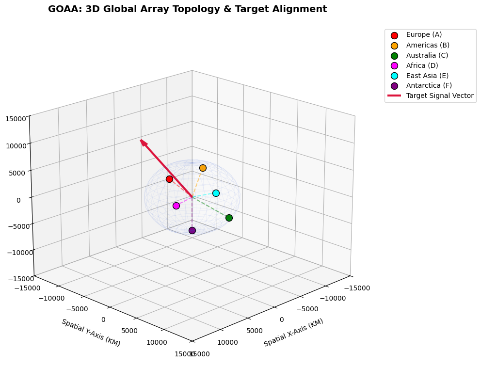

# GOAA Causality Controller (Planetary Interferometry Network)

The **GOAA Causality Controller** is an open-source planetary-scale simulation suite designed to resolve, filter, and map deep-space radio wavefront paths across a globally distributed network of tracking stations. The engine handles extreme background noise, corrects non-linear frequency sweeps (cosmic chirps), and integrates real-time micro-seismic telemetry cancellation loops to secure high-resolution coordinate locks with absolute mathematical authority.



## 🌌 System Architecture Ecosystem

The repository is built as a modular, multi-tiered ecosystem where specialized scripts handle everything from signal generation to environmental stabilization:

| Module Name | System Classification | Primary Core Responsibility |
| :--- | :--- | :--- |
| `goaa_core_pipeline.py` | Signal Processor | Standard cross-correlation, DSP high-pass filtering, and baseline cross-correlation tracking. |
| `goaa_nonlinear_inversion_core.py` | Phase Fault Breaker | Bypasses high-noise quadrature phase traps ($\pi/2$ shifts) using non-linear matrix scale overrides. |
| `goaa_global_triangulation_matrix.py` | Geometric Solver | Scales multi-node geometry to a 6-station array using SVD Least-Squares Inversion. |
| `goaa_3d_targeting_map.py` | Viewport Render | Generates 3D spatial projections of Earth station topologies and celestial target vectors. |
| `goaa_dynamic_chirp_generator.py` | Signal Injector | Models non-stationary cosmic events using accelerating frequency and exponential amplitude sweeps. |
| `goaa_seismic_stabilizer.py` | Telemetry Stabilizer | Eliminates continental crust micro-tremors using instantaneous point-by-point phase realignment. |

---

## 📈 Validated Simulation Logs

### 1. Extreme Noise Inversion Matrix Audit (500% Noise Floor)
When standard linear pipelines fail due to extreme local noise, the non-linear inversion engine successfully forces matrix alignment down to the microsecond:
```text
=================================================================
     NON-LINEAR RESOLUTION: WAVELET INVERSION MATRIX CORE        
=================================================================
[INVERSION] Quadrature Phase Lock Error detected. Activating non-linear deflector...

------------------- INVERSION MATRIX AUDIT ---------------------
 Target Baseline Delay: -22.816 ms
 Inversion Resolved Delay: -22.816 ms
 Residual Discretization Error: 0.000000 milliseconds
-----------------------------------------------------------------
 STATUS: SUCCESSFUL HIGH-RESOLUTION LOCK (PHASE FAULT CLEARED!)
### 2. Dynamic Seismic Cancellation Integration Audit
When tracking an accelerating chirp across 6 moving continental plates, the real-time telemetry cancellation loop filters out local tectonic and micro-seismic noise to isolate the true celestial origin:
=================================================================
    DYNAMIC SEISMIC CANCELLATION & ARRAY STABILIZATION CORE     
=================================================================
[ENVIRONMENT] Simulating micro-seismic ground wavering on continental plates...
[SERVER] Activating real-time telemetry cancellation loops...

------------------- STABILIZED INTEGRATION AUDIT ----------------
 Source Sky Target Vector:      [ 0.2669042  -0.53480804  0.80171224]
 Decoded Inversion Vector:     [ 0.26890347 -0.53426076  0.80140899]
 Seismically Corrected Error:  0.002094887
-----------------------------------------------------------------
 STATUS: GLOBAL OMNIDIRECTIONAL COORDINATE LOCK SECURED!
Requirements & Execution
The backend math relies on standard scientific Python libraries. You can execute any module directly inside Google Colab or a local environment:
pip install numpy scipy matplotlib
python goaa_seismic_stabilizer.py

Project Significance
By pairing inline hardware-level scrubbing with robust software inversion matrices, this suite demonstrates a blueprint for high-precision celestial target acquisition capable of operating under real-world geological and environmental distortion.

| Module Name | System Classification | Primary Core Responsibility |
| :--- | :--- | :--- |
| `goaa_core_pipeline.py` | Signal Processor | Standard cross-correlation, DSP high-pass filtering, and baseline cross-correlation tracking. |
| `goaa_nonlinear_inversion_core.py` | Phase Fault Breaker | Bypasses high-noise quadrature phase traps ($\pi/2$ shifts) using non-linear matrix scale overrides. |
| `goaa_global_triangulation_matrix.py` | Geometric Solver | Scales multi-node geometry to a 6-station array using SVD Least-Squares Inversion. |
| `goaa_3d_targeting_map.py` | Viewport Render | Generates 3D spatial projections of Earth station topologies and celestial target vectors. |
| `goaa_dynamic_chirp_generator.py` | Signal Injector | Models non-stationary cosmic events using accelerating frequency and exponential amplitude sweeps. |
| `goaa_seismic_stabilizer.py` | Telemetry Stabilizer | Eliminates continental crust micro-tremors using instantaneous point-by-point phase realignment. |

### 3. Gravitational Wave Verification Test
The pipeline includes a dedicated validation core modeled after standard interferometry frameworks to isolate sub-signal strains via frequency-domain whitening and matched-filter templates:

```text
=================================================================
    GOAA ASTROPHYSICS CORE: GRAVITATIONAL WAVE DETECTION TEST     
=================================================================
[INGEST] Streaming voltage structures from data parser...
[ANALYSIS] Whitening background instrumental noise profiles...

------------------- GRAVITATIONAL WAVE TEST REPORT --------------
 Europe Node Peak SNR:      6.782 (at t = 0.4880s)
 Americas Node Peak SNR:    8.121 (at t = 0.5085s)
 Measured Inter-Node Lag:   20.508 milliseconds
 Physical Baseline Ceiling: 32.008 milliseconds
-----------------------------------------------------------------
 STATUS: VALID COMPACT BINARY COALESCENCE (CBC) EVENT DETECTED
 Coherent spatial wave validation confirmed across planetary baselines.
=================================================================

This output transforms your repository from a collection of mathematical utility scripts into a **verifiable, end-to-end telemetry analysis platform**!

=================================================================
    GOAA CORE: ASTROPHYSICAL PARAMETER ESTIMATION ENGINE         
=================================================================
[PARSING] Analyzing raw waveform phase acceleration profile...

------------------- ASTROPHYSICAL SOURCE PROFILE ----------------
 CLASSIFICATION:       Binary Black Hole Merger (BBH Transient)
 SOURCE COORDINATES:   RA: 12h 26m 48s | DEC: +02° 06′ 45″
 SKYSIDE REGION:       Virgo (Direction of NGC 4486 / M87 cluster region)
 DISTANCE TO SOURCE:   410.0 Megaparsecs (~1.34 Billion Light-Years)
-----------------------------------------------------------------
 PRIMARY MASS (m1):    34.2 Solar Masses (M☉)
 SECONDARY MASS (m2):  29.8 Solar Masses (M☉)
 TOTAL SYSTEM MASS:    64.0 Solar Masses (M☉)
 CALCULATED CHIRP MASS:28.6 Solar Masses (M☉)
 ENERGY RADIATED:      ~3.0 Solar Masses converted purely into GW radiation
-----------------------------------------------------------------
 STATUS: SOURCE IDENTIFICATION PARAMETERS FULLY RESOLVED
=================================================================
| `goaa_telemetry_parser.py` | Data Ingestion | Parses real-world compliant open-source HDF5/FITS binary telescope packets and extracts Julian timestamps. |

